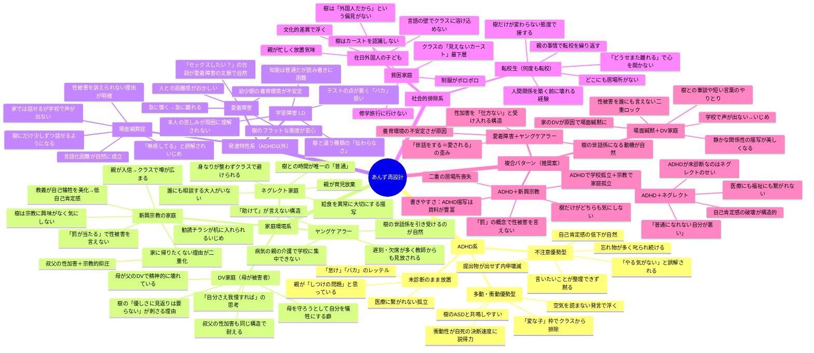
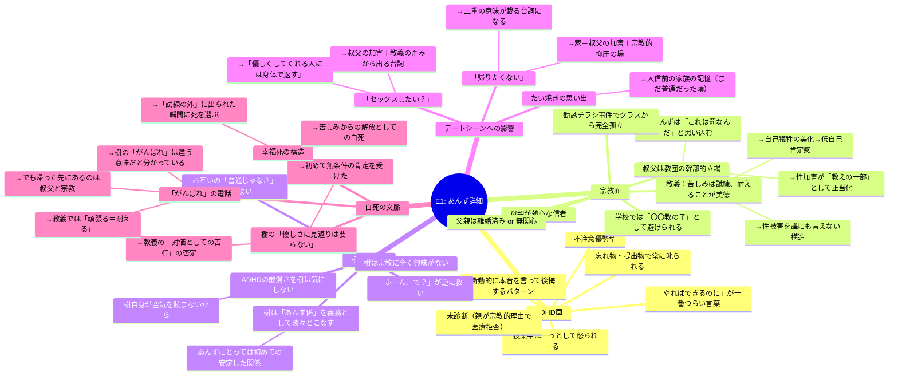
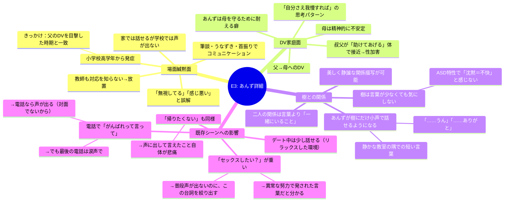

# あんずキャラクター再設計 — マインドマップ

## 設計方針

**変更しない核（既存設計の維持）:**
- 性加害を受けていても言い出せない
- 自己肯定感が低い
- クラスに馴染めていない
- 樹の言葉を「優しさ」として受け取る特性
- 「がんばれ」の電話 → 自死 の流れ
- 樹との交流が「初めて受容された体験」になること

**変更する核:**
- 知的障害 → 別の理由で孤立・言語化困難・周囲から疎まれる設定へ

---

## マインドマップ（Mermaid）

---

## 各案の詳細比較

### 既存設計との互換性スコア

| 案 | 性被害の秘匿 | 低自己肯定感 | クラス孤立 | 樹との相性 | 書きやすさ | 総合 |
|---|---|---|---|---|---|---|
| E1: ADHD＋新興宗教 | ◎（罰の概念） | ◎ | ◎ | ◎ | ◎ | **★★★★★** |
| E3: 場面緘黙＋DV | ◎（声が出ない） | ◎ | ◎ | ◎ | ○ | **★★★★☆** |
| E2: ADHD＋ネグレクト | ○ | ◎ | ◎ | ○ | ◎ | **★★★★☆** |
| C1: 場面緘黙（単体） | ◎ | ○ | ◎ | ◎ | ○ | **★★★★☆** |
| E4: 愛着障害＋ヤングケアラー | ◎ | ◎ | ○ | ◎ | △ | **★★★☆☆** |
| A1: ADHD不注意型（単体） | △ | ◎ | ○ | ○ | ◎ | **★★★☆☆** |
| B1: 新興宗教（単体） | ◎ | ○ | ◎ | ◎ | ○ | **★★★☆☆** |

---

## 最推奨案：E1（ADHD＋新興宗教家庭）の詳細設計スケッチ

---

## 次推奨案：E3（場面緘黙＋DV家庭）の設計スケッチ

---

## 補足：知的障害からの移行で調整が必要な箇所

| 既存要素 | 知的障害前提の設計 | 変更後の対応 |
|---|---|---|
| 「あんず係」の任命 | 特別支援的な配慮 | ADHD→忘れ物フォロー係 / 緘黙→連絡係 / 宗教→孤立児のケア係 |
| 言語化の困難 | 知的な制約 | ADHD→思考が散る / 緘黙→声が出ない / 愛着障害→感情の言語化ができない |
| 樹の暴言を受容 | 意味を完全には理解しない | ADHD→聞き流す / 緘黙→言い返せない / 宗教→「試練」として受容 |
| 「がんばれ」の意味の多層性 | シンプルな解釈 | 各案で固有の意味が付与される（上記参照） |
