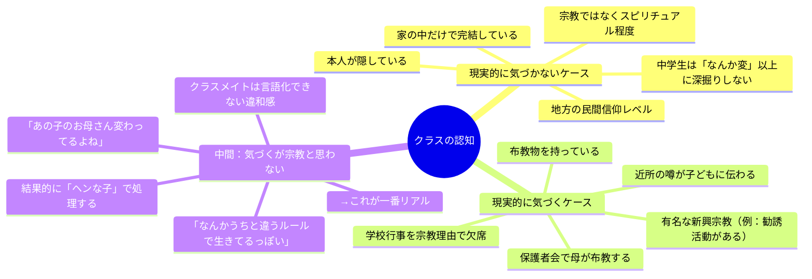

```mermaid
mindmap
  root((宗教スパイスの是非))
    A[入れない案]
      A1[母親の彼氏が性加害者]
        シンプルで書きやすい
        読者に説明コスト低い
        母親が彼氏に依存
          経済的に頼っている
          「この人がいないと生きていけない」
          あんずが訴えても信じない構造
        あんずが言えない理由
          母の幸せを壊したくない
          「言ったら捨てられる」恐怖
          前に暗示したら母が泣いた→二度と言えない
        クラスで浮く理由はADHDだけで十分
          忘れ物・衝動発言・片付けできない
          「ヘンな子」で完結
        樹が異変に気づかない理由
          家庭の話をあんずがしない
          樹はそもそも他人の家庭に興味がない
          ADHDの行動だけ見えている
        欠点
          設定がやや平凡
          「帰りたくない」の重層性が薄い
          あんず固有の世界観が弱い
      A2[母親の元夫 再接近型]
        離婚した父が面会で接触
        母はDVで別れたのに面会を止められない
        法的に面会権がある苦しさ
        あんずが拒否しても「お父さんなんだから」
        性加害の場が限定的→発覚しにくい
    B[入れる案：公然型]
      B1[宗教がバレている]
        問題点：樹が気づかないのが不自然
        解決策
          B1a[樹は知っているが気にしない]
            「宗教？ふーん」で終わる
            ASD的に宗教＝情報の一つ
            異変＝宗教ではなく性加害
            宗教を知っていても性加害には気づけない
            むしろ「宗教の子だから変」で思考停止
          B1b[クラスは知っているが樹は知らない]
            樹が噂に興味がないから耳に入らない
            あんず自身が樹にだけ隠す
            「樹には普通の私でいたい」
            バレた時のエピソードが書ける
          B1c[学校では隠せている]
            あんず自身が必死に隠している
            たまにボロが出る（お守り・食事制限・行事不参加）
            クラスは「なんか変」程度
            樹は断片に気づくが繋げられない（ASD）
        公然型の利点
          社会派テーマとして深みが出る
          読者の問題意識を刺激
          あんずの内面の複雑さが増す
        公然型の欠点
          宗教描写の取材・リアリティ負荷
          物語の焦点がブレるリスク
          樹との関係性以外に説明が必要
    C[入れる案：隠然型（推奨）]
      C1[宗教色を薄めたスピリチュアル系]
        「宗教」ではなく母のスピリチュアル依存
        パワーストーン・占い・ヒーリングセミナー
        クラスメイトには宗教と認識されない
        あんずが時々変なブレスレットをしている程度
        「お母さんが言ってた」で変な価値観が出る
        利点
          宗教ほど重くない
          現代のリアルな貧困家庭に自然
          セミナー講師＝性加害者にできる
          献金→セミナー費用で貧困が加速
        樹の反応
          ブレスレット→「なにそれ」「お母さんの」「ふーん」
          異常に気づく材料はあるが繋げない
      C2[母の依存先に宗教的人物がいる]
        正式な宗教団体ではない
        カリスマ的な「先生」に母が心酔
        その「先生」が家に出入り→性加害
        母は「先生は特別な人」と信じている
        あんずが訴えても「先生がそんなことするわけない」
        クラスには見えない（家の中の話）
        樹にも見えない
        利点
          宗教の重さなしに宗教的構造を使える
          「親が信じている人に裏切られる」が強い
          母子の関係が壊れる構造
          あんずの孤立が家庭内で完結
      C3[祖母の代からの信仰]
        新興宗教ではなく地域の民間信仰的なもの
        祖母→母→あんずの三代
        「うちはこういう家だから」の呪縛
        外から見ると「ちょっと変わった家」程度
        教義的な縛りが生活に染み込んでいる
        性加害者は信仰コミュニティの年長者
        利点
          大げさでなく自然
          「家の文化」として処理できる
          樹が知っても「変わった家だな」で済む
    D[入れる案：効果限定型]
      D1[宗教は過去の話]
        小学校時代に母が入信→あんずが嫌な思いをした
        中学までに脱会済み
        でも心に残った傷
          「罰が当たる」の思考パターン
          自分を犠牲にする癖
          大人を信じられない
        現在の性加害者は別人（母の彼氏）
        利点
          宗教描写を最小化
          でも内面への影響は使える
          クラスは宗教のことを知らない
          過去の設定だから取材負荷低い
      D2[宗教はあんず視点でのみ語られる]
        FB（フラッシュバック）シーンでだけ登場
        樹の視点では宗教は見えない
        読者はあんず視点で初めて全貌を知る
        樹のACTでは「ヘンな子」でしかない
        利点
          本編の焦点がブレない
          後出しの衝撃として機能
          樹の「わかってあげられなかった」が強化
    E[性加害者の選択肢]
      E1[母親の彼氏]
        最もシンプル
        母が経済依存→あんずが犠牲
        「言ったら彼氏が出て行く→母が壊れる」
        日常的にアクセス可能→被害が継続的
      E2[スピリチュアル系の「先生」]
        母の心酔が盾になる
        「浄化」等の名目で性加害
        あんずは自分が汚れていると思い込む
        非日常感があり描写に工夫できる
      E3[母の彼氏＋スピ要素の合体]
        母の彼氏がスピリチュアルに詳しい
        母はその知識にも依存
        「この人は特別」と母が信じている
        あんずが訴えても「あの人は悪い人じゃない」
        宗教ほど大げさでなく自然
      E4[教祖的人物]
        組織的な背景が必要→描写コスト高
        ただし権力構造が明確で動機が自然
        「帰りたくない」に宗教施設の意味も載せられる
    F[「ヘンな子」の見え方設計]
      F1[ADHDだけでヘンな子は成立するか]
        成立する
          衝動的発言「えっなんでそんなこと言うの」
          持ち物がぐちゃぐちゃ
          急に立ち歩く
          集団行動からズレる
        ただし「避けられる」まで行くには
          ADHDだけだと「天然」で済む可能性
          もう一つ何かあると確実
      F2[ADHD＋家庭の影が見える]
        身なりが若干だらしない（貧困）
        お弁当が適当or持ってこない
        たまに青あざ（彼氏のDV or 性加害の痕跡）
        クラスメイトは理由を知らない
        「あの子なんかヤバい」という空気
        樹はこれらを認識しない（ASD）
      F3[ADHD＋匂い・生活感]
        貧困家庭で入浴頻度が低い
        服が同じ→「くさい」と言われる
        中学生は残酷→即座に排除
        これだけでクラス孤立は成立
        ADHD＋この要素で「どうしようもなくヘンな子」
      F4[宗教が「ヘンさ」に少しだけ寄与する場合]
        C1案のブレスレット・食事制限・行事不参加
        「なんでいつもそれつけてるの？」「お母さんが…」
        宗教とは誰も思わない程度の違和感
        ADHD＋貧困＋この微妙な違和感
        三重に「ヘンな子」が補強される
```

# あんず設計：宗教スパイスを入れるべきか — 発散マインドマップ

## 前提（確定要素）

- 母子家庭・貧困
- 多動気味（ADHD傾向）
- 性加害を受けている → 言い出せない
- 自己肯定感が低い
- クラスに馴染めていない

## 争点：宗教要素を入れるか？入れるならどう機能させるか？

---

---

## 推奨組み合わせ3案

### 案1：シンプル最強（宗教なし）
**母子家庭＋貧困＋ADHD＋母の彼氏が性加害**

- 描写コスト：低
- 書きやすさ：最高
- リアリティ：高（実際にある構造）
- 弱点：あんず固有の「世界観」がやや薄い

### 案2：スピリチュアル隠し味（軽い宗教色）
**母子家庭＋貧困＋ADHD＋母がスピリチュアル依存＋「先生」or 彼氏が加害者**

- 描写コスト：中
- 書きやすさ：高
- リアリティ：高（現代日本で実在する構造）
- 利点：あんずの「罰」「浄化」思考に説得力が出る
- 利点：「帰りたくない」に家庭の異常さが載る
- 利点：宗教ほど重くないのでクラスにはバレない

### 案3：過去の宗教＋現在の彼氏（二段構え）
**幼少期に宗教体験（脱会済み）＋現在は母の彼氏が性加害**

- 描写コスト：低〜中
- 書きやすさ：高
- 利点：宗教が内面の傷として機能し、現在の加害構造は別
- 利点：FB2で過去の宗教体験が明かされる衝撃
- 利点：「罰が当たる」思考の根拠が過去にある

---

## 現実性チェック：「ヘンな子＝宗教」とクラスが気づくか？

**結論：「中間」が最もリアル。** 中学生はあんずの家庭の異常さを「宗教」とは名指しできない。ただ「なんか変」と感じて距離を取る。これはADHD＋貧困だけでも成立するが、スピリチュアル要素を足すと「説明できない違和感」が厚くなる。
