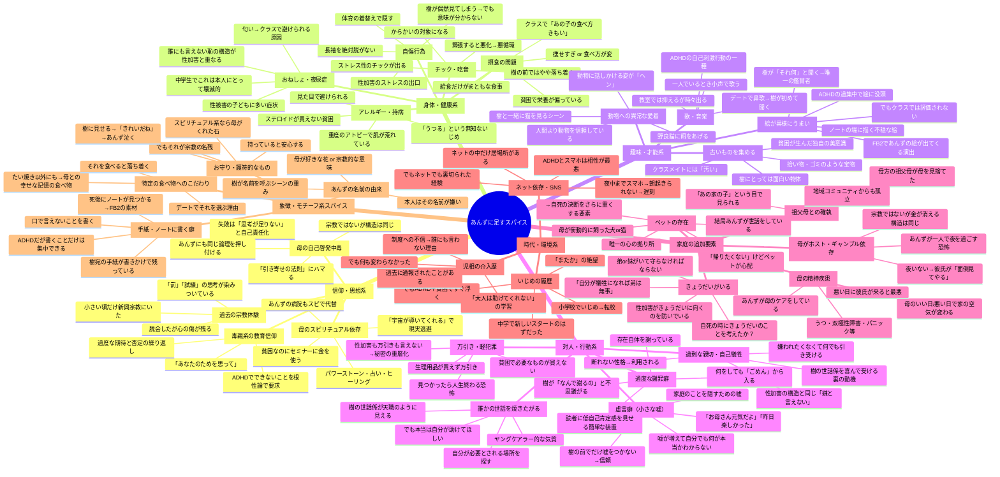

# あんず：追加スパイス全方位ブレインストーミング

## ベース確定要素
- 母子家庭・貧困・ADHD多動気味・性加害を受けている・言い出せない・低自己肯定感・クラス孤立

## 目的
ベースに「もう一味」加えることで、あんずの固有性・物語の深み・書けるエピソードの幅を広げるスパイスを探す。

---

---

## スパイスの効果別マトリクス

| スパイス | 性被害秘匿の補強 | クラス孤立の補強 | 樹との関係の深化 | 書けるシーン増 | 描写コスト |
|---|---|---|---|---|---|
| D1 過剰な親切 | ◎ | △ | ○ | ○ | 低 |
| D4 謝罪癖 | ○ | △ | ◎ | ○ | 低 |
| G4 手紙・ノート | ○ | △ | ◎ | ◎ | 低 |
| B2 自傷行為 | ◎ | ○ | ◎ | ◎ | 中 |
| C1 絵がうまい | △ | ○ | ◎ | ◎ | 低 |
| E2 きょうだい | ◎ | △ | ○ | ◎ | 中 |
| E5 ペット | ○ | △ | ◎ | ◎ | 低 |
| A1 スピリチュアル母 | ◎ | ○ | ○ | ◎ | 中 |
| E1 母の精神疾患 | ◎ | ○ | ○ | ◎ | 中 |
| D2 虚言癖 | ◎ | ○ | ◎ | ◎ | 中 |
| F3 児相介入歴 | ◎ | ○ | △ | ○ | 低 |
| B3 夜尿症 | ◎ | ◎ | ○ | ○ | 中 |
| D3 万引き | ◎ | ○ | △ | ◎ | 中 |

---

## 推奨スパイスの組み合わせ例

### パターンA：書きやすさ最優先
**ベース＋D4謝罪癖＋G4ノートに書く癖＋E5ペット**
- 性格描写が自然に深まる
- ノートがFB2の伏線装置になる
- ペットが「帰りたくない、でも…」のジレンマを生む
- 追加の取材負荷ほぼゼロ

### パターンB：感情の深度最優先
**ベース＋B2自傷＋E2きょうだい＋D1過剰な親切**
- 自傷が性加害の可視化装置
- きょうだいを守るための自己犠牲構造
- 読者の感情を強く揺さぶる
- ただし重くなりすぎるリスクあり

### パターンC：樹との関係最優先
**ベース＋C1絵がうまい＋D4謝罪癖＋G4ノート**
- 絵が二人の接点になる（樹が理屈で分析、あんずが感覚で描く）
- 謝罪癖に樹が「なんで？」→ASD的に本気で不思議がる
- ノートと絵がFBの素材になる
- 軽やかでありながら奥行きがある

### パターンD：宗教の隠し味入り
**ベース＋A1スピ母（性加害者は母の彼氏）＋D4謝罪癖＋G3お守り的なもの**
- 母のスピ依存で貧困が加速
- 「罰」思考が自然に入る
- お守りが象徴として機能
- 宗教の重さなしに宗教的構造が使える
