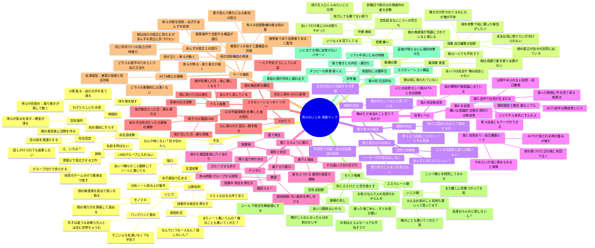

```mermaid
mindmap
  root((秀斗のいじめ 発散マップ))
    手法
      言語攻撃
        いじり
          バックハンド褒め
            すごいよな友達いなくても平気で
            天才は違うなあ俺ら凡人とは住む世界ちゃうわ
          質問形式
            なんでいつも一人なん？寂しないん？
            またノート書いてんの？俺のことも書いてくれた？
          モノマネ
            樹の喋り方を誇張して真似る
            樹の無表情を真似て笑いを取る
        陰口
          あいつ俺らのこと観察してノートに書いてる
          なんか怖くない？目が合わんし
          女子経由で広める
        公開処刑
          分析ノート読み上げ事件
          テストの点を大声で言う
          授業中の発言を茶化す
      非言語攻撃
        空気操作
          秀斗が目配せ→取り巻きが察して動く
          秀斗が笑みを消す→教室が凍る
          樹の発言後に沈黙を作る
          わざとらしいため息
        排除
          グループ分けで余らせる
          席替えで孤立させる工作
          LINEグループに入れない
          体育のチーム分けで最後まで残す
        物理的
          机を微妙にずらす
          持ち物を隠す
          D案 殴る→自分の手を見て凍る
        存在否定
          話しかけられても返事しない
          目の前を素通りする
          え、いたの？
          名前を呼ばない
    動機の層
      表層 嫌い
        いつも人を見下してる
        樹の無表情が馬鹿にされていると感じる
        空気読まないことへの苛立ち
      中層 嫉妬
        母が主人公くんみたいにと比較
        努力しても勝てない怒り
        参観日で樹の父の無条件の愛を目撃
        あいつだけ楽に100点取りやがって
      深層 自己嫌悪の投影
        樹を攻撃で母に勝った報告がしたい
        本当は母に怒りたいが向けられない
        樹の孤立が自分の空洞に似ている
        俺の方が好かれてるのになぜ俺が不幸
      最深層 羨望
        樹は成績で愛を買う必要がない
        樹は一人でも平気そう
        樹は母に操られていない
        あいつは自由や 俺は自由じゃない
    取り巻きの構造
      積極的共犯
        秀斗に認められたくて率先する子
        秀斗より過激にエスカレートする危険
      消極的追従
        空気を読んで同調する大多数
        俺は何もしてないと思っている
      沈黙の目撃者
        心では可哀想と思うが動けない
        あんずと同じポジション？
      取り巻きの中の秀斗
        リーダーだが命令はしない
        雰囲気で支配→母の支配構造の再演
        取り巻きにも本心を見せない
    自覚レベル
      案A 完全無自覚
        母の鬱憤が無意識に出ている
        いじめ自覚なし＝樹ACT4と完全鏡像
        俺はただ本当のこと言うてるだけ
      案B 半自覚
        嫌いは意識的 加害の深刻さは無自覚
        いじりやん本気にすんなよ
        既存設定と整合 最もリアル
      案C 自覚あり→自己嫌悪ループ
        やめたいが母に責められると再発
        樹を傷つけた日の夜に布団で泣く
        ACT5で赦される時の重みが増す
      案D 途中で自覚が生まれる
        ACT1前半は無自覚いじり
        殴った瞬間に手を見て凍る 転換点
        以降やめられない自覚→自己嫌悪
        秀斗自身にもアークができる
    場所と状況
      教室
        授業中 発言を茶化す
        休み時間 グループから排除
        掃除時間 汚い場所を押し付ける
      廊下と階段
        すれ違いざまの舌打ち
        肩をぶつける 偶然か故意か曖昧
        聞こえるように悪口
      放課後
        帰り道で待ち伏せ
        塾で再会
        母から電話直後に八つ当たり
      デジタル
        既読スルー
        グループから外す
        裏アカで悪口
    エスカレーションのトリガー
      テスト結果
        樹に負けた日は激化
        同率の日は沈黙
        樹が失敗した日→急に優しくなる？
      母からの電話LINE
        あの子は何点だったの直後の爆発
        母が泣いた日→最も危険
        母が無言だった日→最も壊れる
      父の介入
        父に殴られた翌日→樹を殴る
        父の不倫現場を目撃した後の荒れ
      樹の無自覚な優位
        先生に褒められた直後
        一人で平気そうにしている姿
        あんずと話している
    テーマ接続
      母の支配構造の再演
        母が泣く→秀斗が動く
        秀斗が黙る→取り巻きが動く
        感情操作で支配する構造が遺伝
        被害者であり加害者である二重性
      ACT4樹との鏡像
        友達面型→善意の指導と完全対称
        どちらも客観的には悪くない
        どちらも相手のためという自己正当化
      善意が人を殺す三重構造の伏線
        秀斗の加害動機の根は母の愛
        愛が歪んで暴力になる最初の提示
      あんずの孤立との並行
        秀斗が樹を排除↔女子があんずを排除
        同じ学校で2つの孤立が同時進行
        樹は自分の孤立に耐えるがあんずの孤立に気づけない
    セリフ候補
      いじり期
        友達おらんのに寂しないん？
        また難しい言葉つかってる笑
        俺のことも書いてくれた？笑
      空気支配期
        別にええけど と目を逸らす
        ふーん で発言を無価値にする
        あいつ関係ないやろ
      エスカレート期
        お前さなんで人の気持ちわからんの
        みんなお前のこと気持ち悪いって思ってるで
        こいつ俺らを研究してるキモ
      崩壊の兆し
        殴った後ごめん→すぐお前が悪い
        お前はええよな一人でも平気そうで
        俺がこんなんなったんはお前のせいや
    参考軸
      タコピーの原罪 東くん
        表面的には優等生
        家庭の闘が学校に漏れ出す
      聲の形 石田将也
        エスカレーション構造
        取り巻きとの共犯→裏切り
      リアル中学いじめの特徴
        証拠が残らない心理的攻撃が主
        いじめてる側に自覚がないパターン
```
