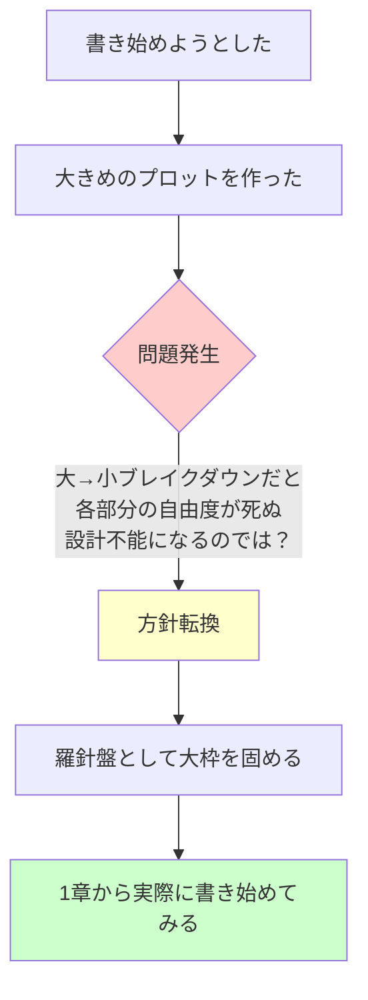
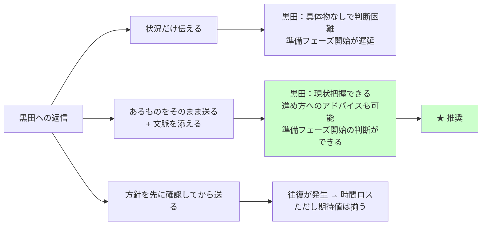

# 黒田への返信戦略 — たたき台

## 状況整理

| 項目 | 黒田の認識（前提） | 実際 |
|------|-------------------|------|
| 原稿 | ある程度書き進めている | ほぼゼロ |
| プロット | 完成に近い | 未完成・模索中 |
| 準備フェーズ | 始められる状態 | 条件未達 |

**誤解の核心：** 黒田は「書き進められているか」を聞いているが、
実態は「書き進め方を模索している段階」。
「書けていない」ではなく「進め方を決めている最中」という文脈が抜けている。

---

## 会話の目的（優先順位順）

1. **誤解を解消する**（原稿ゼロ ≠ 何もしていない）
2. **現状を正確に伝える**（今どういう状態か）
3. **準備フェーズの開始条件を確認する**（今あるもので始められるか？何が足りないか？）」

---

## 現状の論理構造

**今あるもの：**
- ① 未完成プロット（大枠レベル）
- ② 1章から書き始めた試み（途中）

---

## アクション選択と結果

---

## 返信メッセージの論理（伝えたいこと）

### フレーミング
> 「原稿が出来ていない」ではなく「書き進め方を模索している段階」

### 伝える順序

1. **現状報告**
   > 原稿はほぼゼロです。ただ、何もしていないわけではなく、「どう書き進めるか」を決めている段階です。

2. **何をやっていたかの説明**
   > ①大きめのプロットを作ってみた → ②大→小ブレイクダウンだと各部分の自由度が消えて設計不能になるのでは？という意見を受け → ③羅針盤として大枠を書き、まず1章から書き始めてみる、という方針に転換しました。

3. **今あるものを送る意思表示**
   > 未完成プロットと書き始めた1章分を送ります。

4. **確認したいこと**
   > この段階で準備フェーズを始められますか？何が足りないか教えてもらえると助かります。

---

## 返信文案（草稿）

黒田さん

確認ありがとうございます。一点、状況の補足をさせてください。

> 回答：友人なので敬語は不要

正確にいうと、原稿がある程度できているというより、
「書き進め方を模索している段階」です。

具体的にやってきたこと：
①大きめのプロットを作ってみた
②ただ、大→小ブレイクダウンだと各部分の自由度が死ぬ（設計不能になる）
　という問題意識があって
③羅針盤として大枠を固め、1章から実際に書き始めてみる、という方向に転換しました

今あるのは「未完成のプロット」と「1章の書き始め」です。
これをいったん送ります。

この段階で準備フェーズに入れますか？
何が足りていないか、何を先に固めるべきかを教えてもらえると助かります。

> 回答：大枠はこの内容でAgree。文章で伝えると長くなるから簡潔な1文＋draw.ioがベター
> あと、黒田のいう「準備」が未定義：これは何なのかはっきりさせたい
---

## 補足：準備フェーズの条件確認

**黒田の準備（準備.png より）**
- 原稿を読む
- 課題を洗い出す（テーマ・プロット・キャラ・場面バランス等）
- 到達目標と改善案を提示

**おさかなの準備（準備.png より）**
- レジュメを作る（テーマ一文・プロット概要・キャラリスト）
- 自分のプロットに沿って一日の区切りまで書き進める

→ **課題：** おさかな側の「一日の区切りまで書き進める」が未達
→ **交渉ポイント：** 今あるもので始めて、書き進めながら準備フェーズと並走できないか？