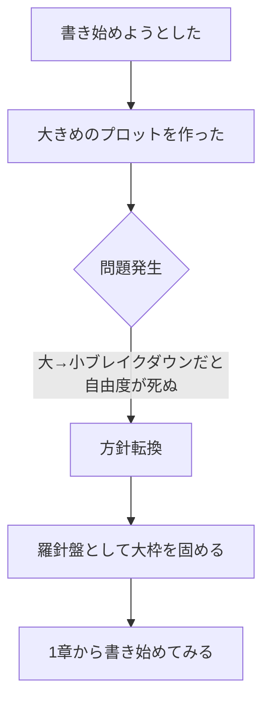

# 黒田への返信 — たたき台

## 状況整理

| 項目 | 黒田の認識（前提） | 実際 |
|------|-------------------|------|
| 原稿 | ある程度書き進めている | ほぼゼロ |
| プロット | 完成に近い | 未完成・模索中 |
| 準備フェーズ | 始められる状態 | 条件未達 |

**誤解の核心：** 黒田は「書き進められているか」を聞いているが、実態は「書き進め方を模索している段階」。

---

## 会話の目的（優先順位順）

1. 誤解を解消する（原稿ゼロ ≠ 何もしていない）
2. 現状を正確に伝える
3. 準備フェーズの開始条件を確認する

---

## 現状の論理構造

**今あるもの：**
- 未完成プロット（大枠）
- 1章の書き始め

---

## ★ 未解決：「準備」の定義が未定義

黒田の質問「準備の段階を終えるのにどれくらいかかりそうか」の前提が曖昧。

### 準備.png から読み取れる完了条件

| 誰 | やること | 完了条件の曖昧さ |
|----|---------|----------------|
| おさかな | レジュメ作成 | テーマ・プロット・キャラリストが揃えばOK？ |
| おさかな | 一日の区切りまで書く | 「一日の区切り」＝何？（章？シーン？ページ数？） |
| 黒田 | 原稿を読む→課題洗い出し | おさかなが「送れる状態」になることが前提 |

### 確認すべき問い

1. 「一日の区切りまで書く」とは具体的に何を指すか？
2. レジュメだけでも黒田は動けるのか？原稿も必要か？
3. 今ある状態（未完成プロット＋1章書き始め）で準備フェーズ開始できるか？

---

## 返信の方針（ユーザー確認済み）

- 敬語不要（友人）
- 文章より **1文 + draw.io** で伝える
- 「準備」の定義をはっきりさせることを目的に含める

---

## 次のステップ（未着手）

- [ ] 「準備」定義の仮説を置くか、黒田に確認を求めるかを決める
- [ ] draw.io の構成を決める
- [ ] 送付する1文を確定する
