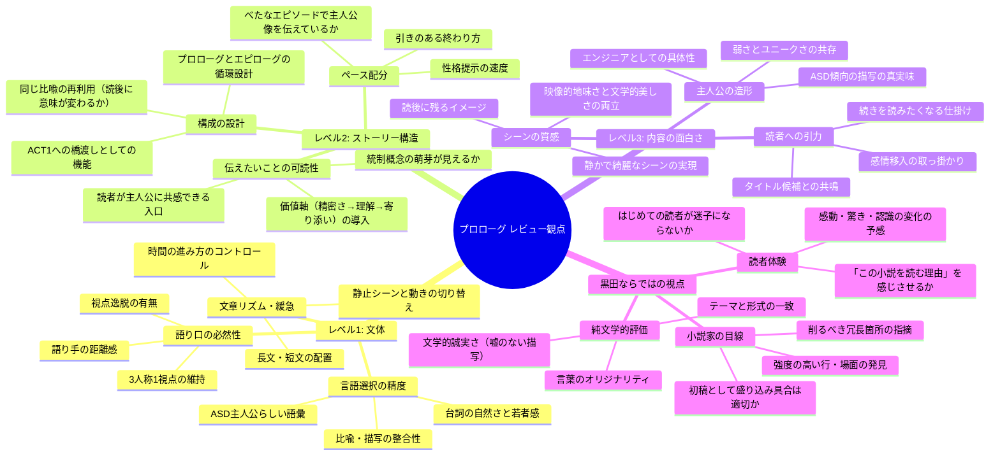

# プロローグ レビュー観点マインドマップ

## mermaid マインドマップ

---

## 観点ごとの解説

### レベル1: 文体

**語り口の必然性**
3人称1視点（主人公の視点に固定した三人称）が正しく維持されているかを確認する。視点が知らず知らず他キャラに移ったり、全知的な情報が混入していないかが焦点。黒田・takaya両者がこの視点選択を支持しているため、その運用の厳密さが問われる。

**文章リズム・緩急**
黒田が「時間の進み方の緩急制御」を重要視していた。静止した内省シーンと動きのある場面が交互に配置されているか、一本調子になっていないかを見る。takayaが指摘した「静かできれいなシーン」が生きているかもここで確認できる。

**言語選択の精度**
主人公がASD傾向のエンジニアであることを、語彙や比喩の選び方で体現しているか。台詞の自然さと若者らしさ（takayaの「シュモクバエ」タイトル評価が示す感覚）も確認ポイント。

---

### レベル2: ストーリー構造

**伝えたいことの可読性**
統制概念「理解できなくても寄り添える」がプロローグの時点でその萌芽として予感されるか。まだ明確に示す必要はないが、価値軸の「出発点（精密さで世界を守ろうとする）」は読み取れるか。

**構成の設計**
黒田が「プロローグとエピローグに循環と差異を設計する」と言及。日記シーンの比喩が読後に意味を変える構造が、プロローグの段階で意図的に仕込まれているか。

**ペース配分**
黒田の指摘「べたなエピソード×性格で読者に主人公を伝える」が実現できているか。主人公の個性が自然なエピソードを通じて提示されているかを確認する。

---

### レベル3: 内容の面白さ

**主人公の造形**
ASD傾向の描写が的外れでなく、リアルで共感可能な形になっているか。過剰な説明（診断名の前面出し）を避けつつ、読者が主人公の世界観を体感できるか。

**シーンの質感**
takayaが「映像にしたら地味でも、静かできれいなシーンがある」と評価。その「静かな美しさ」がプロローグで体現されているか。

**読者への引力**
第1シーンを読み終えた読者が「続きを読みたい」と感じるための仕掛けが機能しているか。感情移入の入口、謎の提示、登場人物への関心など。

---

### 黒田ならではの視点

**小説家の目線**
黒田の「初稿はクオリティ無視でもりもりに書いてそぎ落とす」という姿勢を踏まえ、削るべき冗長箇所と残すべき強度の高い部分を具体的に指摘してもらう。

**純文学的評価**
純文学として、言葉の選択にオリジナリティと誠実さがあるか。一般的な比喩や凡庸な表現に頼っていないか。テーマと語り方の形式が一致しているか。

**読者体験**
はじめてこの小説に触れる読者が、プロローグだけで「この作品を読む意味がある」と感じられるか。過度な説明なしに世界へ引き込む力があるか。
