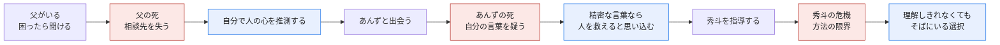
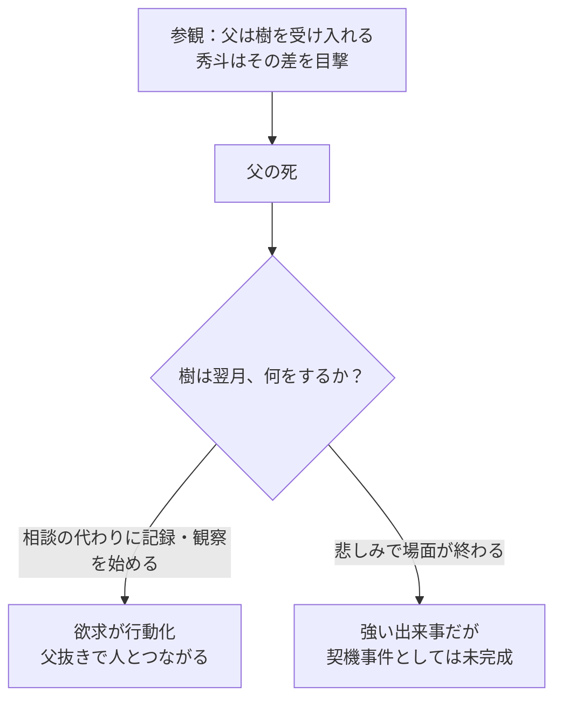
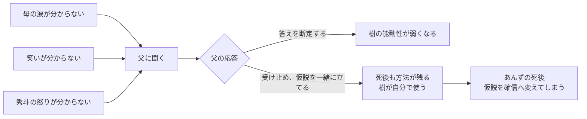
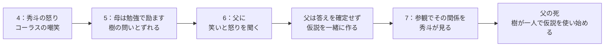
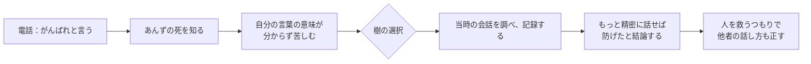
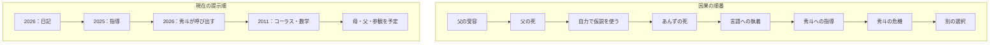
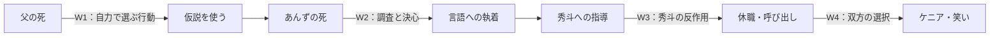

# 『シュモクバエのこと、笑ってやろうぜ』構造分析

2026年9月29日更新。対象：[現本文](シュモクバエのこと、笑ってやろうぜ.md)、[配置方針](シーンの配置方針.md)、未採用の[旧ACT1](../_内部/old/本文_ACT構成_2026-09-02/ACT1/ACT1.md)・[旧ACT2](../_内部/old/本文_ACT構成_2026-09-02/ACT2/ACT2.md)・[あんずの電話](シーン素材/あんずの電話/シーン設計.md)。**現本文にないものは設計案であり、確定稿ではない。**

## 結論：二つの死は別の役割にできる

**暫定案**：父の死＝「頼る相手を失い、自分で人を理解しようとする」転機。あんずの死＝「自分の言葉が何をしたか分からない」経験から、方法が**精密な言語への執着**へ硬直する契機事件。旧ACT設計も、父の死を第1幕クライマックス、あんずの死を「物語全体の契機事件」としていた。ただし現稿では、そのあいだの樹の選択が未執筆なので旧設定をそのまま確定とはしない。

## 父の死だけで契機事件になるか

Story Compiler の契機事件は均衡を壊し、主人公に**欲求と行動**を生む必要がある。

「頼れなくなった」は**失ったもの**であって、まだ**欲求の対象**ではない。「父に聞かずに母の涙の理由を確かめる」「笑わせ方を自分で試す」など、父の不在ゆえの最初の選択があれば契機事件になる。旧[父の死の設計](../_内部/old/本文_ACT構成_2026-09-02/ACT1/SEQ2_父との絆と喪失/S5_父の死.md)は「来月もまた来る」の約束が消え、月1回の面会が空白になる場面。その空白を見せる方針は有効。

## 父が「全部解決してくれた」場合

**笑いの話は父の場面で一度扱った方がよい。** コーラス事件で樹が最も傷ついたのは「面白い」が分からず、人と同じように笑えないことだから。父に持ち込めば、父が特別な理由が具体化する。ただし「笑いの正解」まで教えさせると、樹が後年それを使うだけの人物になる。父は「分からないのはつらいな」「秀斗は何を面白がっていたと思う？」と受け止め、**仮説と確かめ方を一緒に考える**。父自身にも分からない部分を残す。

### 父の場面に統合するなら

現行4は**2011年・中学生**。旧素材の母、父、参観は**小6〜中1直後**。上図は読書順としては作れるが、時系列順ではない。4の直後に5へ進むなら、年代を戻す標識と「なぜ今この過去を見るのか」という現在側の理由が要る。年代を揃えて書き直す道もある。

## あんずの死は「決心」か

**死は出来事。決心は、それに対して樹が選ぶ行為。** 旧案では、電話で求められた「がんばれ」を樹が文字通りに伝え、その後の死によって「自分の言葉が何を後押ししたか分からない」罪悪感が生じる。ただし[電話のシーン設計](シーン素材/あんずの電話/シーン設計.md)だけでは、樹は何も知らず勉強に戻る。決心は**死を知った後**に置く。

この経路なら、あんずの死は追加の喪失ではなく、**父から受け継いだ「仮説」という道具の使い方が変質する事件**になる。旧[影響分析](シーン素材/あんずの電話/v1/その他/impact_report.md)も、死から誤信念へ飛ばず、調査と結論の間を要確認としていた。

## 情報開示とドラマの二本線

提示順は謎を作る一方、読者が追う**現在の目的**は秀斗の呼び出しで中断する。回想が続くなら、各回想が「樹はなぜ秀斗を誤読したか」を一段ずつ変え、現在へ戻ったときの選択に影響する必要がある。父の死やあんずの死を後で明かすこと自体は問題ではない。**開示のたびに現在の意味が変わるか**が判定点。

## Story Compiler アラート地図

| 優先 | ルール | 確認点 |
|---|---|---|
| 高 | `08_inciting-incident` / `06_protagonist` | 父の死の直後、樹は**何を得たいと決め、何を始めるか**。あんずの死後、欲求はどう変質するか。 |
| 高 | `14_causal-chain` | あんずの死→「精密な言語なら救える」には、樹自身の調査・解釈・選択が要る。秀斗の呼び出し→ケニアも未接続。 |
| 中 | `13_scene-transition` | 小6の父・参観と中2のコーラス・数学を、現在の問いに沿ってどう並べるか。 |
| 中 | `01_core-structure` / `19_scene-mastery` | 5は「母の心配が分かる」という情報だけで終えず、樹が父に持っていく問いを変える。 |
| 中 | `05_controlling-concept` | 父がすべての正解を知る人物になると、仮説の暫定性と後年の誤用が弱まる。 |

**暫定の一本線**：「父を失った樹は、人とつながるために自分で心を推測し始める。あんずを失ったことで推測の不確かさに耐えられなくなり、言葉を正せば人を守れると信じる。その方法が秀斗を追い詰めたとき、理解しきれない相手との関わり方を選び直す」。これを採るなら、全編の主な引き金はあんずの死、父の死はそこへ至る最初の不可逆な喪失になる。

未執筆部分の欠如を `compile_error` とは判定しない。これは今後の設計に対する `warning` の地図である。根拠：[契機事件](../../story-compiler/modules/08_inciting-incident.yaml)、[主人公の欲求](../../story-compiler/modules/06_protagonist.yaml)、[因果鎖](../../story-compiler/modules/14_causal-chain.yaml)、[シーン遷移](../../story-compiler/modules/13_scene-transition.yaml)。
