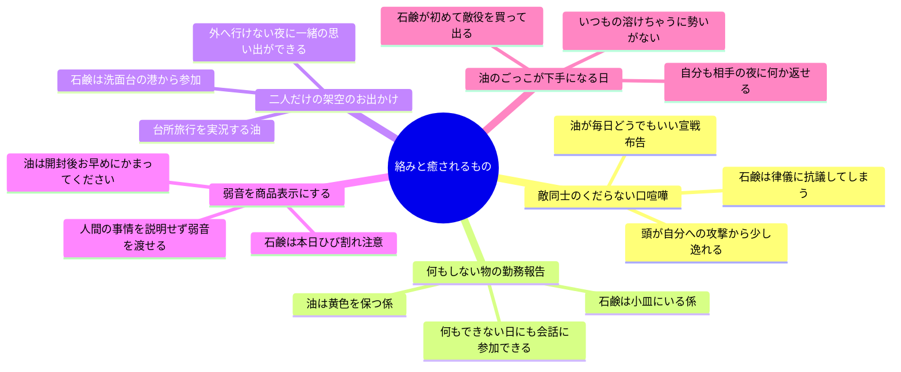
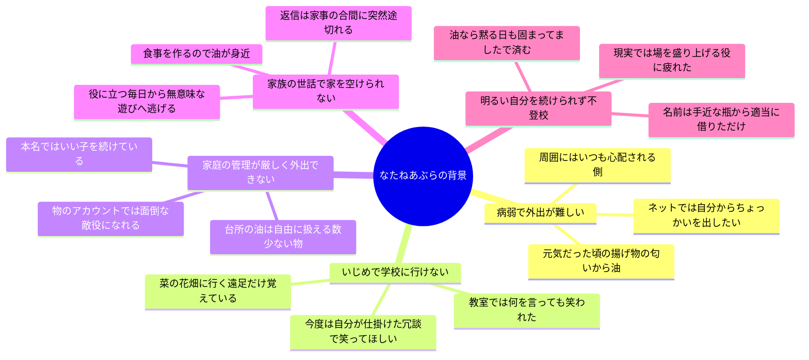
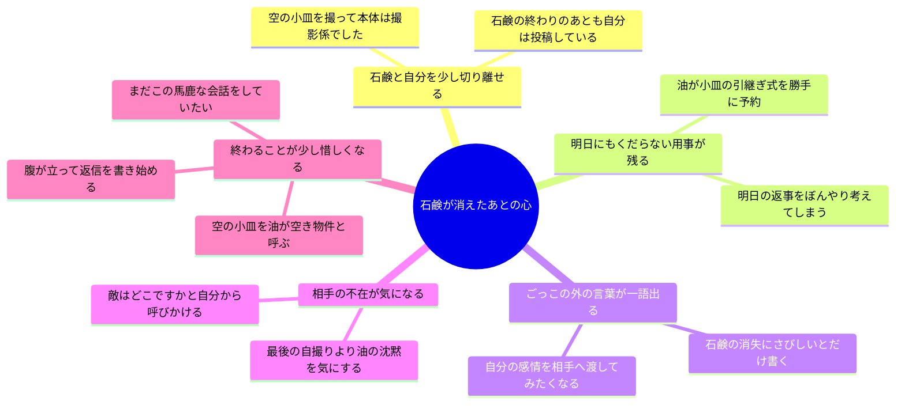

---
tags:
  - 小っちゃい石鹸
  - brainstorm
  - map
status: アイデア候補・未採用
---

# 小っちゃい石鹸 — 未定事項3つのマインドマップ

元の種：[構想.txt](構想.txt) ／ 入口：[[workspace_hub]]

構想の未定事項を「絡み・何が癒されるか」「なたねあぶらの背景」「最後の心の動き」の3つにまとめた候補集。各枝は別案で、別のマップの枝とも自由に組み合わせられる。「癒される」は、会話の中で少し緩む感覚として考える。

## 1. どんな絡みをするか・何が癒されるか

## 2. なたねあぶらのバックボーン

本文には背景を明示せず、投稿の癖や、ごっこを選んだ理由にだけ滲ませる案。

## 3. 最後にどういう心の動きをするか

石鹸がすり減り、自撮りから消える案を起点にした分岐。

気になった枝から会話を一往復書く。背景・癒され方・結末の組み合わせは、その会話が面白くなってから選べばよい。
