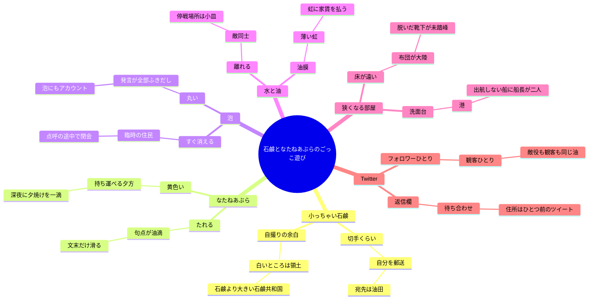
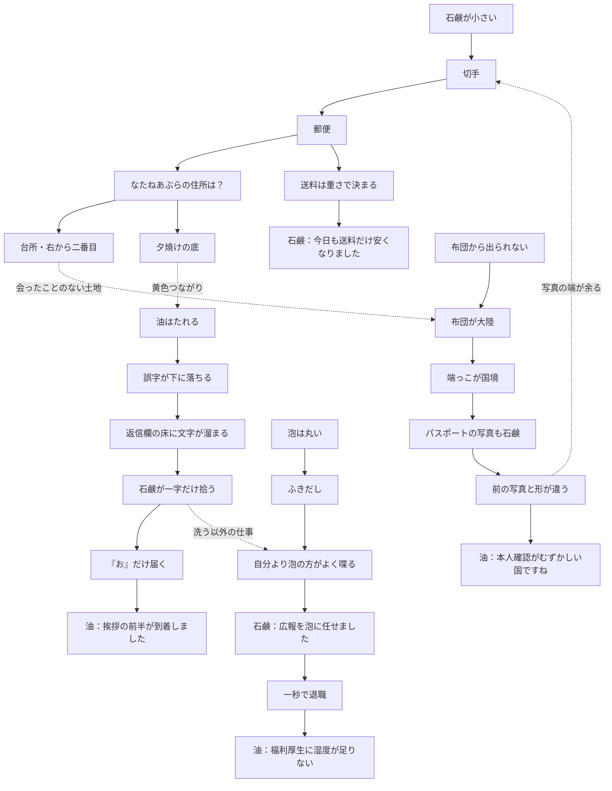
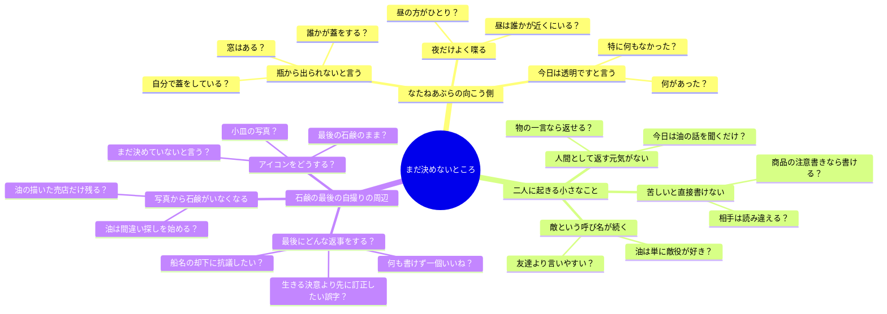

---
tags:
  - 小っちゃい石鹸
  - brainstorm
  - map
status: 連想候補・未採用
---

# 小っちゃい石鹸 — ごっこ遊びの連想マップ

元の種：[構想.txt](構想.txt) ／ 入口：[[workspace_hub]]

ここにあるのは全部、枝を伸ばすための候補。矢印は「それといえば？」で、出来事の順番ではない。矛盾する枝も残してよい。

まずは気になる末端から、もう一つだけ連想する。意味がわからなくても、二人がその言葉で遊べそうなら置いておく。

## 1. 物から始める

## 2. 別の枝へ飛ぶ

一つの素材を説明し尽くすより、途中で別の素材につないで遊ぶ。

この世界が本当にそうなっている必要はない。片方が言い出して、もう片方が一行乗るだけでも、ごっこは成立する。

## 3. しんどい場面と空想の間に置けそうなもの

空想が終わっても、手の痛さや部屋の狭さは残っていてよい。現実の小さな物が、次の馬鹿なやり取りにも持ち越される。

| しんどい側にあるもの | 連想のリレー | 二人が始めそうなこと |
| --- | --- | --- |
| また手を洗ってしまい、指が痛い | 濡れた石鹸 → 雨 → 撮影延期 | 自撮りに「天候不良のため顔の一部が流れています」。油が「屋内ですよね」と返す。痛い指で、その返事を見る。 |
| 掃除できず、行ける場所が減る | 狭い床 → 島 → 観光案内 | 油が「本日のおすすめスポットは枕の裏です」。石鹸は地図だけ描く。現地へは行けない。 |
| 消えたい気持ちを、人間の言葉では書けない | 石鹸の近況 → 商品説明 → 注意書き | 「本品は本日、うまく喋れません」。油が「ではこちらが勝手に喋ります」と、どうでもいい天気予報を連投する。 |
| 返信が来ず、画面を何度も見る | 不在 → 店休 → 貼り紙 | 石鹸が「本日休業？」と送る。あとで油が「倒れていました。瓶が」と返す。どちらの意味だったか、すぐには聞かない。 |
| 家の外の音だけ聞こえる | 車の音 → 波 → 洗面台の港 | 二人で船の名前を考える。石鹸が全部「せっけん丸」にし、油が全部却下する。現実の車がもう一台通る。 |
| 写真の石鹸が昨日より小さく、見ているのがつらい | 余白 → 空き地 → 勝手な入居 | 油が画像の余白に極小の売店を描く。「何を売るの」「まだ決めてません」。石鹸の小ささには、その日は触れない。 |

### 短い往復の種

**敵の休日**

> 油「あなたは私の敵です」  
> 石鹸「今日は敵をする余裕がありません」  
> 油「わかりました。見学します」  
> 石鹸「何を」  
> 油「敵の休日」

**固体と液体**

> 石鹸「考えない物になりたかったのに、物になっても考えています」  
> 油「固体だからでは」  
> 石鹸「そうなんですか」  
> 油「液体の私は考えが全部横に流れます」  
> 石鹸「それも困りそう」  
> 油「いま右の方に大事な考えが行きました」

**ごっこの齟齬**

> 油「きゃー、私が溶けちゃう」  
> 石鹸「元から液体でしょう」  
> 油「せっかく悲鳴をあげたのに」

**何もできない日の仕事**

> 石鹸「今日は何もできなかった」  
> 油「わたしも瓶の中にいました」  
> 石鹸「仕事は」  
> 油「黄色を保つ係」  
> 石鹸「勤務時間が長い」

この会話の直後に、笑いきれなかったり、通知を待ちながらまた手を洗ってしまったりする場面も置ける。逆に、しんどい独白の途中へ、油のしょうもない訂正が一行だけ割り込んでもよい。交互の長さは揃えなくてよい。

## 4. 未定のところは、質問の枝にする

なたねあぶらの事情は、今は「言い方」「投稿する時間」「急にやめる話」などの種だけ置く。病気・学校・家庭などの答えへ進めたくなったら、そのとき別の枝を足す。

## 5. 自分で次の枝を足すための、半分だけの言葉

- 石鹸置きといえば、＿＿。そこへ油が引っ越すなら、＿＿。
- 油が絶対に滑りたくないものは、＿＿。
- 泡が履歴書に書く特技は、＿＿。石鹸が落とす理由は、＿＿。
- 二人が大真面目に揉める、どうでもいい議題は、＿＿。
- なたねあぶらが一度だけ、ごっこの言葉を忘れるとしたら、＿＿。
- 石鹸が小さくなった写真に、油が勝手に足すものは、＿＿。
- つらい日の会話に関係なく、油が急に言い出すことは、＿＿。
- 最後まで何の意味も持たせなくていい、二人の内輪ネタは、＿＿。

「これが主人公をどう救うか」は、枝を伸ばす途中では保留する。まず、二人にもう一往復させたくなるものを拾う。
